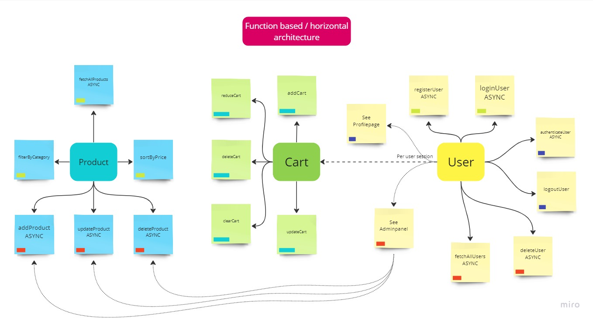
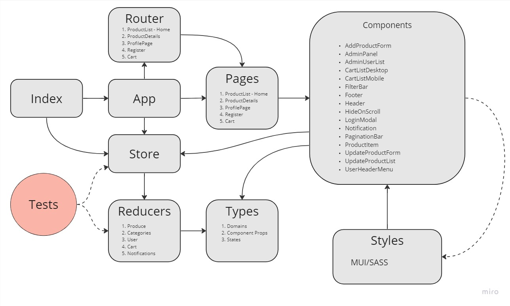

# Front-end Project - ecommerce shop

## Introduction:

A frontend ecommerce project providing a basic webshop experience with the use of a public API endpoint [https://fakeapi.platzi.com/](https://fakeapi.platzi.com/).

The project provides CRUD operations for Products, Users, Categories as well as fileuploads and authentification.

The project is build with create-react-app and Typescript using Redux toolkit for statemanagement. Additional external libraries to mention are react-router for routing, axios for fetching and Material-UI for styling.

## Table of Content:

1. Introduction
2. Table of Content
3. Getting Started
4. Usage
5. Architecture & Design
6. Testing
7. Deployment

## Getting Started:

Clone the repo with git clone git@github.com:galeksi/ecommerce-project.git

Install all dependencies with `npm intstall`  or `yarn install`.

No .env file or further config needed.

## Usage:


#### Scripts:

- `npm start`: start dev server
- `npm test`: run all tests
- `npm run build`: create production build
- `npm run eject`: Remove single build dependency from project


#### Features:



## Architecture & Design:


#### The project follows a horizontal arcitecture:




State in managed globally with a redux-toolkit store with its reducers/slices in folder "redux". There are five main pages handled with react-router:

- Homepage/ProductList
- ProductDetail page
- Cart
- Register page
- Profile page

```
.
├── public
├── src
│   ├── components
│   ├── hooks
│   ├── pages
│   ├── redux
│   ├── test
│   ├── types
│   ├── utils
│   ├── App.tsx
│   ├── index.scss
│   ├── index.tsx
│   ├── react-app-env.d.ts
│   ├── reportWebVitals.ts
│   └── setupTests.ts
├── Features.jpg
├── Horizontal-Structure.jpg
├── package-lock.json
├── package.json
├── README.md
└── tsconfig.json
```

## Testing:

`npm test`: run all tests 

Testing is done wit build in Jest testing library. Testing includes unit testing for all five reducers (Prosucts, Users, Categories, Cart and Notifications) and their operations. All server requests in the tests are handeled with a mock server (msw).

## Deployment:

To deploy run optimized production build with npm run build and provide build for any statig website hosting platform.

Public version is hosted with [https://vercel.com/](https://vercel.com/)
